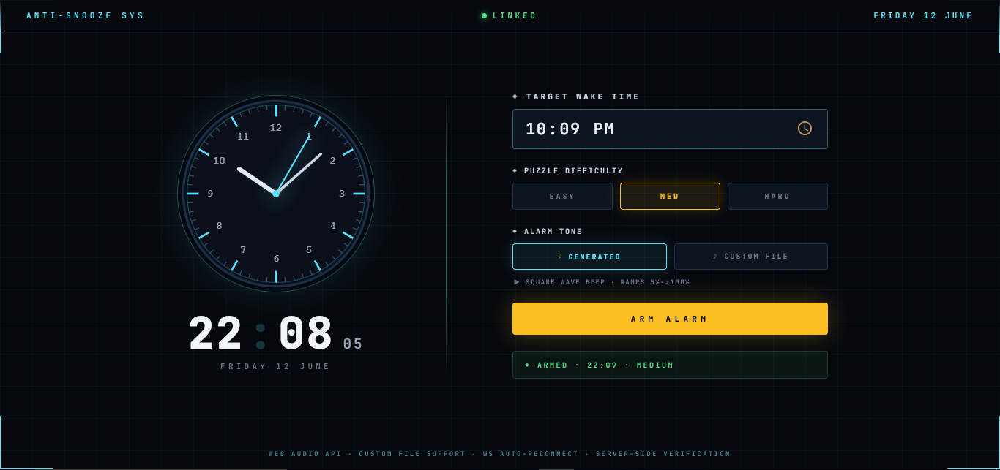

## ⏰ Anti-Snooze Alarm Clock System 

A high-tech digital alarm clock dashboard built to stop you from mindlessly hitting snooze in the morning. This system locks your screen and forces your brain to wake up by solving puzzles before the alarm finally turns off.</small>

---

#### ◈ What It Does (The Anti-Snooze Concept)

> Standard alarms are too easy to turn off while you are half-asleep. **Anti-Snooze** changes that:
> 1. **Unbreakable Overlay:** When the alarm goes off, a full-screen block covers the dashboard and locks out quick bypasses like the `Escape` key.
> 2. **Rising Volume:** The alarm sound starts very quiet (**5%**) and automatically climbs to full volume (**100%**) over 30 seconds.
> 3. **Brain Exercises:** To stop the sound, you must complete **3 quick games** in a row.

<small>*Note: All puzzle grids are custom-sized to a compact, single-screen view (~250px height) so you never have to scroll down to read instructions while waking up.*</small>

---

#### ◈ Live Demo & Preview

<small>Try out the live web deployment, set test alarms, and practice your puzzle response speeds:</small>

> 🔗 **Live Demo Link:** `Deployed Link Here`



---

#### ◈ The 3 Wake-Up Puzzles

<small>You must clear these stages in order to turn off the alarm:</small>

* **Math Puzzle (`MathPuzzle.jsx`):** Solves quick arithmetic equations (e.g., additions or multiplications) to kickstart your logical thinking.
* **ZIP Grid (`ZipPuzzle.jsx`):** A path-drawing grid where you must drag a single line to connect numbered nodes ($1 \rightarrow N$) while filling up every empty block.
* **Block Pattern (`BlockPattern.jsx`):** A visual memory game. Blocks flash on the screen for a couple of seconds, and you must click the exact spots from memory.

---

#### ◈ Technology Used

* **React (Vite):** Powering the interactive user interface, settings, and layout styling.
* **Framer Motion:** Animates the puzzle screens so they slide smoothly as you pass each stage.
* **Web Audio API:** Generates the raw alarm beep sound right in the browser and controls the volume ramp.
* **FastAPI (Python):** The backend server that runs the master time-tracker clock.
* **WebSockets:** Creates a constant live connection between the frontend and backend with a **3-second auto-reconnect safety loop** to trigger the alarm instantly.

---

#### ◈ Project Directory & Structure

```text
├── backend/
│   ├── main.py            # Runs the FastAPI server, tracks time, and alerts the browser
│   └── requirements.txt   # Backend Python files list
├── frontend/
│   ├── src/
│   │   ├── components/
│   │   │   ├── AlarmOverlay.jsx  # Pop-up manager (listens to server, loads games)
│   │   │   ├── MathPuzzle.jsx    # Stage 1: Math game file
│   │   │   ├── ZipPuzzle.jsx     # Stage 2: Line grid game file
│   │   │   └── BlockPattern.jsx  # Stage 3: Memory pattern game file
│   │   ├── App.jsx               # Main dashboard layout (displays clocks & settings panel)
│   │   ├── index.css             # Main styling, custom font setups, and background colors
│   │   └── main.jsx              # Launches the React app
│   ├── package.json
│   └── vite.config.js
└── README.md